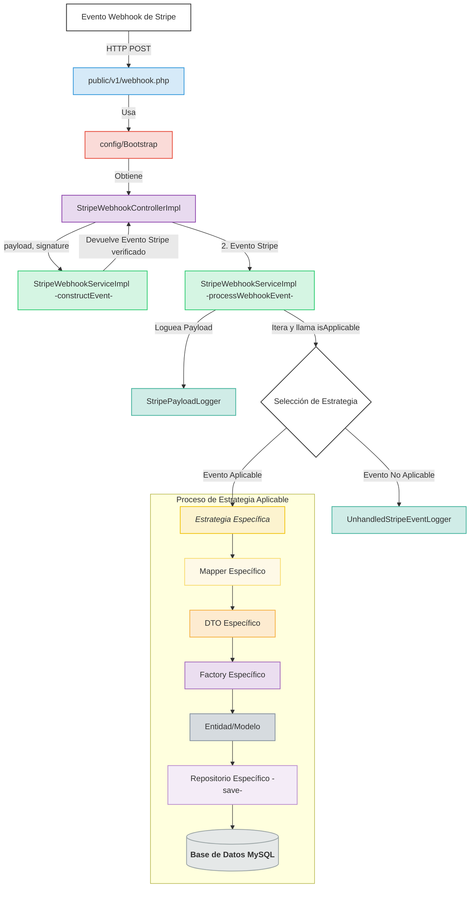
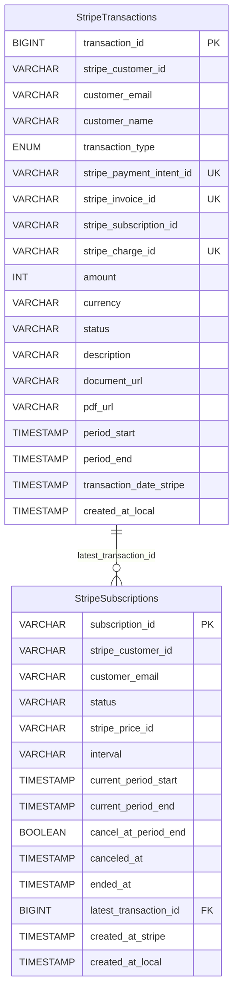

---

# StripeLabApp

[](https://www.php.net/)
[](https://stripe.com)

## Aplicación de prueba para la integración de pagos con Stripe

StripeLabApp es una aplicación PHP diseñada para comprender el funcionamiento de la API de Stripe, tanto para pagos únicos como para suscripciones. Esta aplicación de prueba ofrece funcionalidades completas de registro de transacciones, visualización de facturas y gestión de suscripciones.

---

## ✨ Características principales

### Procesamiento de Pagos

-   **Pagos Únicos:** Implementación completa del flujo mediante Stripe Checkout.
-   **Suscripciones:** Soporte para planes mensuales y anuales a través de Stripe Checkout.

### Integración con Stripe

-   **Webhook Completo:** Procesamiento de eventos clave de Stripe:
    -   Gestión de suscripciones (`customer.subscription.created`, `.updated`, `.deleted`)
    -   Registro de pagos de facturas (`invoice.paid`)
    -   Procesamiento de pagos únicos (`payment_intent.succeeded`)
    -   Enriquecimiento de datos (`charge.succeeded`)
    -   Gestión de clientes (`customer.created`, `.updated`)
    -   Confirmación de sesiones (`checkout.session.completed`)

### Gestión de Datos

-   **Persistencia:** Almacenamiento de transacciones y suscripciones en MySQL.
-   **Visualización:** Listado de facturas y suscripciones con paginación y búsqueda.
-   **Acceso a Documentos:** URLs directas a facturas alojadas en Stripe.

### Características Técnicas

-   **Arquitectura en Capas:** Diseño `Controller → Service → Strategy → Mapper/Factory → Repository`.
-   **Logging Detallado:** Archivos separados para eventos, errores, payloads y consultas.
-   **Interfaz de Usuario:** Diseño responsivo con Bootstrap.

---

## 🚀 Guía de Inicio Rápido: Instalación y Configuración

## IMPORTANTE

### Requisitos previos obligatorios para el funcionamiento de la aplicación

Para ejecutar esta aplicación de pagos localmente, necesitarás:

1. **Cuenta de Stripe**
- Crear una cuenta en [Stripe Dashboard](https://dashboard.stripe.com/)
- Acceder a las claves de API en el panel de desarrolladores

2. **Variables de entorno requeridas**

   Configura las siguientes variables en tu archivo `.env` o directamente en tu sistema:

   ```bash
   STRIPE_SECRET_KEY=sk_test_your_secret_key_here
   STRIPE_PUBLISHABLE_KEY=pk_test_your_publishable_key_here
   STRIPE_WEBHOOK_SECRET=whsec_your_webhook_secret_here
   ```
3. **Crear productos asociados a precios con las siguientes claves de búsqueda (lookup_key)**

- lookup_key: one_payment
- lookup_key: monthly_subscriptions
- lookup_key: annual_payment

4. **Configurar Base de datos**
- Para facilitar el uso de la aplicación se ha facilitado un archivo docker-compose.yml que levanta una base de datos con las tablas necesarias.
```bash
    cd database/docker/
    docker-compose up --build -d
    ```
- Si por el contrario prefieres conectarte a otra bbdd tienes la estructura de tablas en database/tables.txt.

**Se recomienda el uso de docker-compose encarecidamente por su extrema sencillez**
---


### Prerrequisitos

Asegúrate de tener instalado lo siguiente:

-   PHP 8.0.0 o superior
-   Composer
-   Servidor web (Apache, Nginx o servidor embebido de PHP)
-   MySQL
-   Cuenta de Stripe con claves API y secreto de webhook
-   Stripe CLI (muy recomendado para pruebas locales)
-   Docker y Docker Compose (para levantar la base de datos fácilmente)

### 1. Configuración en Stripe

1.  **Cuenta de Stripe:** Crea una cuenta en [Stripe Dashboard](https://dashboard.stripe.com/).
2.  **Claves API:** Accede a tus claves API en el panel de desarrolladores. Necesitarás la clave publicable (`pk_test_...`) y la secreta (`sk_test_...`).
3.  **Crear Productos y Precios:** En tu dashboard de Stripe, crea los productos y precios que usará la aplicación. Debes asignarles las siguientes **claves de búsqueda (lookup_key)** para que la aplicación pueda encontrarlos:
    -   `one_payment` (para el producto de pago único)
    -   `monthly_subscriptions` (para el precio de la suscripción mensual)
    -   `annual_payment` (para el precio de la suscripción anual)

### 2. Instalación Local

1.  **Clonar el Repositorio**
    ```bash
    git clone https://github.com/JosCarRub/StripeLabApp.git
    cd StripeLabApp
    ```

2.  **Instalar Dependencias**
    ```bash
    composer install
    ```

3.  **Configurar Variables de Entorno**
    Copia el archivo `.env.example` a `.env` y rellena los valores con tus credenciales y configuraciones.
    ```bash
    cp .env.example .env
    ```
    Contenido del `.env`:
    ```env
    # Claves de Stripe
    STRIPE_PUBLISHABLE_KEY=pk_test_xxxxxxxxxxxxxxxxxxxxxx
    STRIPE_SECRET_KEY=sk_test_xxxxxxxxxxxxxxxxxxxxxx
    STRIPE_WEBHOOK_SECRET=whsec_xxxxxxxxxxxxxxxxxxxxxx

    # Claves de búsqueda de Precios de Stripe
    STRIPE_PRICE_LOOKUP_KEY_MONTHLY=monthly_subscriptions
    STRIPE_PRICE_LOOKUP_KEY_YEARLY=annual_payment
    STRIPE_PRICE_LOOKUP_KEY_ONE_TIME=one_payment

    # Precios para mostrar (opcional, para la UI)
    PRICE_DISPLAY_MONTHLY="3,00 €"
    PRICE_DISPLAY_YEARLY="15,00 €"
    PRICE_DISPLAY_ONE_TIME="10,00 €"

    # Base de Datos
    DB_HOST=127.0.0.1
    DB_PORT=3307
    DB_DATABASE=stripe_lab
    DB_USER=test_user
    DB_PASSWORD=password

    # Aplicación
    APP_DOMAIN=http://localhost:8000
    ```

4.  **Configurar la Base de Datos (con Docker)**
    La forma más sencilla es usar el `docker-compose.yml` incluido.
    ```bash
    cd database/docker/
    docker-compose up -d
    ```

### 3. Ejecución

1.  **Iniciar el Servidor PHP**
    Desde la raíz del proyecto, ejecuta:
    ```bash
    php -S localhost:8000
    ```
    La aplicación estará disponible en `http://localhost:8000`.

2.  **Configurar Webhook con Stripe CLI**
    Abre una nueva terminal para reenviar los eventos de Stripe a tu servidor local.
    ```bash
    # Inicia sesión en tu cuenta de Stripe
    stripe login

    # Reenvía eventos a tu endpoint local
    stripe listen --forward-to http://localhost:8000/public/v1/webhook.php
    ```
    > **Importante:** Copia el secreto de webhook (`whsec_...`) que genera este comando y pégalo en tu archivo `.env`.

---

## 🛠️ Uso y Pruebas

Para simular transacciones, utiliza las siguientes tarjetas de prueba proporcionadas por Stripe.

| Número                | Comportamiento                   |
| --------------------- | -------------------------------- |
| `4242 4242 4242 4242` | Pago exitoso                     |
| `4000 0025 0000 3155` | Requiere autenticación 3D Secure |
| `4000 0000 0000 9995` | Fondos insuficientes             |
| `4000 0000 0000 0002` | Pago rechazado (genérico)        |

> Para más opciones, consulta la [documentación de Stripe](https://stripe.com/docs/testing#cards).

Para probar el flujo de webhooks, puedes ejecutar en otra terminal:
```bash
stripe trigger payment_intent.succeeded
```

---

## 🏗️ Arquitectura y Funcionamiento

### Diagrama de Flujo de la Lógica en Servidor



### Esquema de la Base de Datos



### Eventos Soportados

-   `checkout.session.completed`
-   `customer.created` y `customer.updated`
-   `payment_intent.succeeded`
-   `charge.succeeded`
-   `customer.subscription.created`, `.updated` y `.deleted`
-   `invoice.paid`

---

## 🪵 Logs y Solución de Problemas

### Sistema de Logs

Los archivos de log se generan en el directorio `logs/`:

-   `events.log` — Flujo general de la aplicación.
-   `errors.log` — Errores y excepciones.
-   `database.log` — Consultas SQL.
-   `stripe_payloads.log` — Payloads de eventos de webhook.
-   `unhandled_stripe_events.log` — Eventos sin estrategia asignada.

### Solución de Problemas Comunes

-   **Webhook no recibido:** Verifica que `stripe listen` esté en ejecución y que el `STRIPE_WEBHOOK_SECRET` en `.env` sea el correcto.
-   **Errores de base de datos:** Confirma que las credenciales en `.env` son correctas y que el contenedor de Docker está en funcionamiento.
-   **Errores de clase no encontrada:** Ejecuta `composer dump-autoload`.
-   **Errores de Stripe API:** Asegúrate de que las claves API y los `lookup_key` de los precios sean correctos.

---

## 🧩 Extensión del Proyecto

Para añadir soporte a nuevos eventos de Stripe:

1.  Crear los DTOs necesarios en `src/Commons/DTOs/`.
2.  Implementar los Mappers correspondientes en `src/Mappers/`.
3.  Crear la nueva clase de Estrategia en `src/Strategy/Impl/`.
4.  Añadir el nuevo tipo de evento a `StripeEventTypeEnum`.
5.  Registrar la nueva estrategia en `config/Bootstrap.php`.

---

## 📞 Contacto

Si tienes alguna duda sobre el funcionamiento o sobre cómo inicializar la aplicación, no dudes en contactarme.

---


© 2025 JosCarRub