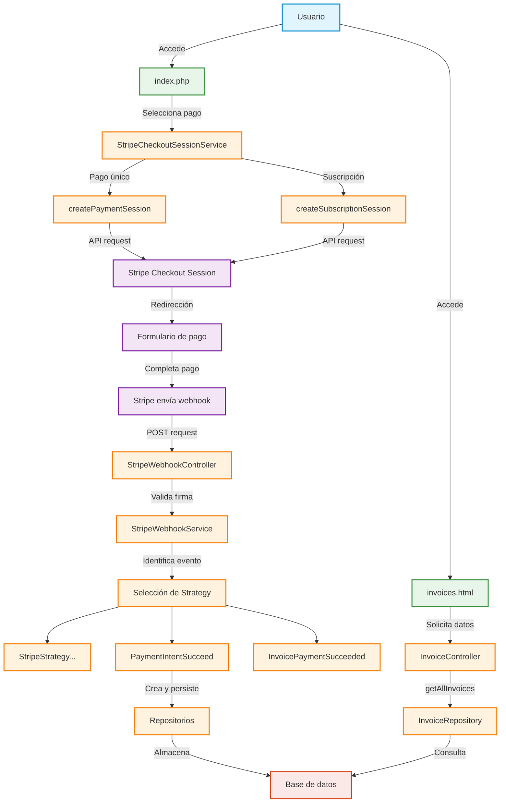

# StripeLabApp

StripeLabApp es una aplicación de integración con Stripe que permite gestionar pagos únicos y suscripciones. La aplicación está diseñada siguiendo los principios de patrones de diseño como Strategy, Factory y Repository para garantizar un código limpio, mantenible y escalable.

## Características principales

- Gestión de pagos únicos a través de Stripe
- Sistema de suscripciones mensuales y anuales
- Procesamiento de webhooks de Stripe
- Gestión de facturas
- Panel de control administrativo
- Visualización de eventos y logs del sistema

## Requisitos previos

- PHP 7.4 o superior
- MySQL 5.7 o superior
- Composer
- Cuenta de Stripe (incluida clave API)
- Stripe CLI (para pruebas locales)

## Instalación

1. Clonar el repositorio:
   ```bash
   git clone https://github.com/tu-usuario/stripelabapp.git
   cd stripelabapp
   ```

2. Instalar dependencias:
   ```bash
   composer install
   ```

3. Configurar el archivo .env:
   ```
   DB_HOST=xxxx
   DB_PORT=xxxx
   DB_DATABASE=xxxx
   DB_USERNAME=xxxx
   DB_PASSWORD=xxxx
   
   STRIPE_PUBLISHABLE_KEY=pk_test_your_key
   STRIPE_SECRET_KEY=sk_test_your_key
   STRIPE_WEBHOOK_SECRET=whsec_your_key
   
   APP_DOMAIN=localhost:8000
   ```

4. Crear las tablas en la base de datos:
   ```sql
   CREATE TABLE payments (
       id_payment VARCHAR(50) PRIMARY KEY,
       event_id VARCHAR(50) NOT NULL,
       customer_id VARCHAR(50) NOT NULL,
       payment_intent_id VARCHAR(50) NOT NULL,
       event_type VARCHAR(50) NOT NULL,
       payload JSON NOT NULL,
       created_at TIMESTAMP DEFAULT CURRENT_TIMESTAMP
   );

   CREATE TABLE invoices (
       id_intern_invoice VARCHAR(50) PRIMARY KEY,
       invoice_id VARCHAR(255) NOT NULL,
       payment_id VARCHAR(50),
       customer_id VARCHAR(50) NOT NULL,
       invoice_number VARCHAR(50),
       amount INT NOT NULL,
       currency VARCHAR(3) NOT NULL,
       status VARCHAR(50) NOT NULL,
       invoice_pdf VARCHAR(255),
       hosted_invoice_url VARCHAR(255),
       customer_email VARCHAR(255),
       customer_name VARCHAR(255),
       subscription_id VARCHAR(50),
       period_start BIGINT,
       period_end BIGINT,
       created_at TIMESTAMP DEFAULT CURRENT_TIMESTAMP,
       FOREIGN KEY (payment_id) REFERENCES payments(id_payment)
   );
   ```

5. Iniciar el servidor:
   ```bash
   php -S localhost:8000 -t public
   ```

## Configuración de Stripe

### Configurar Webhook

1. Instalar Stripe CLI:
   ```bash
   # Seguir las instrucciones según tu sistema operativo
   # https://stripe.com/docs/stripe-cli
   ```

2. Iniciar la sesión con Stripe CLI:
   ```bash
   stripe login
   ```

3. Para pruebas locales, puedes reenviar los eventos de Stripe a tu entorno de desarrollo:
   ```bash
   stripe listen --forward-to localhost:8000/public/webhook.php
   ```

### Planes y productos

Para que la aplicación funcione correctamente, debes configurar los siguientes productos y precios en tu Dashboard de Stripe:

1. Pago único:
   - Nombre: "Pago único"
   - Precio: 10,00 € (o el que prefieras)
   - ID: "one_payment"

2. Suscripción mensual:
   - Nombre: "Suscripción Mensual"
   - Precio: 3,00 € (o el que prefieras)
   - Lookup key: "monthly_subscriptions"
   - Recurrencia: Mensual

3. Suscripción anual:
   - Nombre: "Suscripción Anual"
   - Precio: 15,00 € (o el que prefieras)
   - Lookup key: "annual_payment"
   - Recurrencia: Anual

## Estructura del proyecto

```
config/                 # Configuración de la aplicación
  Bootstrap.php         # Carga todas las dependencias
  DatabaseConnection.php # Conexión a la base de datos
  config.php            # Configuración general

database/migrations/    # Migraciones de base de datos

public/                 # Directorio público
  assets/               # CSS, JS, etc.
  webhook.php           # Endpoint para los webhooks de Stripe
  index.php             # Página principal
  invoices.html         # Página de facturas
  controlPanel.html     # Panel de control

src/                    # Código fuente
  commons/              # Clases comunes (DTOs, entidades, enums)
  controllers/          # Controladores
  factories/            # Factories para crear objetos
  mappers/              # Mappers para convertir datos
  repositories/         # Repositorios para acceso a datos
  services/             # Servicios de negocio
  strategy/             # Implementación del patrón Strategy
```

## Flujo de pago

1. El usuario selecciona un producto (pago único o suscripción)
2. Se crea una sesión de Checkout en Stripe
3. El usuario es redirigido al checkout de Stripe
4. Después del pago, Stripe envía un webhook con los datos
5. La aplicación procesa el webhook y actualiza la base de datos
6. El usuario es redirigido a una página de éxito o cancelación

## Diagrama de flujo



## Panel de control

El panel de control permite:

- Ver el estado de la conexión a la base de datos
- Explorar las tablas de la base de datos
- Ver los logs del sistema
- Gestionar facturas y pagos

## Webhooks soportados

La aplicación soporta los siguientes eventos de webhook:

- `payment_intent.succeeded`: Cuando un pago se completa con éxito
- `payment_intent.payment_failed`: Cuando un pago falla
- `checkout.session.completed`: Cuando se completa una sesión de checkout
- `invoice.payment_succeeded`: Cuando se paga una factura

## Pruebas

Para probar la aplicación sin realizar pagos reales, utiliza las tarjetas de prueba de Stripe:

- Tarjeta exitosa: 4242 4242 4242 4242
- Tarjeta que requiere autenticación: 4000 0025 0000 3155
- Tarjeta que falla: 4000 0000 0000 9995

## Solución de problemas

### Logs

Los logs se almacenan en el directorio `logs/`:

- `errors.log`: Errores del sistema
- `events.log`: Eventos de Stripe procesados
- `payment_session.log`: Logs de sesiones de pago
- `subscription_session.log`: Logs de sesiones de suscripción

### Problemas comunes

1. **Webhook no recibido:**
   - Verificar que Stripe CLI esté corriendo
   - Comprobar la URL de redirección en el panel de Stripe
   - Verificar el secreto del webhook en el archivo .env

2. **Error de base de datos:**
   - Verificar credenciales en el archivo .env
   - Comprobar que las tablas estén creadas correctamente

## Desarrollo y ampliación

Para añadir soporte para nuevos eventos de Stripe:

1. Crear una nueva clase de estrategia en `src/strategy/Impl/`
2. Implementar la interfaz `StripeStrategy`
3. Añadir la estrategia en `Bootstrap.php`

## Licencia

Este proyecto está licenciado bajo la Licencia MIT.
