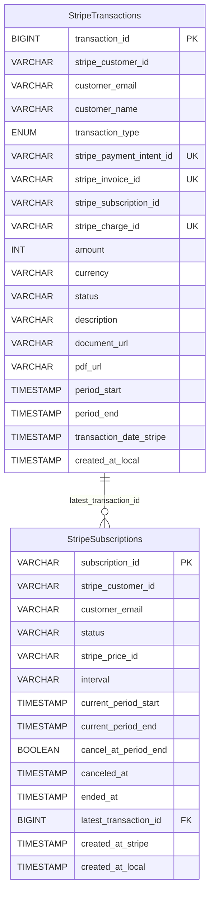
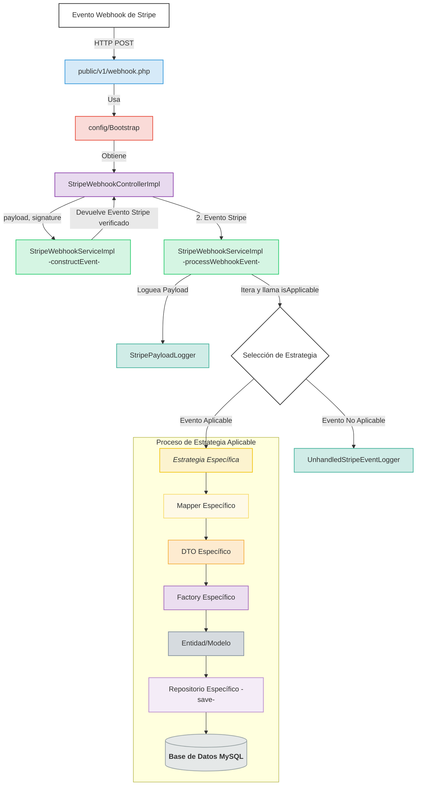

# StripeLabApp

## Aplicación de prueba para la integración de pagos con Stripe

StripeLabApp es una aplicación PHP diseñada para comprender el funcionamiento de la API de Stripe, tanto para pagos únicos como para suscripciones. Esta apliación de prueba ofrece funcionalidades completas de registro de transacciones, visualización de facturas y gestión de suscripciones.

---

## IMPORTANTE

### Si no se cumplen estos requisitos la aplicación no funcionará

### Prerrequisitos

Para ejecutar esta aplicación de pagos localmente, necesitarás:

1. **Cuenta de Stripe**
  - Crear una cuenta en [Stripe Dashboard](https://dashboard.stripe.com/)
  - Acceder a las claves de API en el panel de desarrolladores

2. **Variables de entorno requeridas**

   Configura las siguientes variables en tu archivo `.env` o directamente en tu sistema:

   ```bash
   STRIPE_SECRET_KEY=sk_test_your_secret_key_here
   STRIPE_PUBLISHABLE_KEY=pk_test_your_publishable_key_here
   STRIPE_WEBHOOK_SECRET=whsec_your_webhook_secret_here
   ```

### Configuración de Webhooks de Stripe

1. **Crear endpoint de webhook en Stripe Dashboard:**
  - Ve a **Developers > Webhooks** en tu dashboard de Stripe
  - Haz clic en "Add endpoint"
  - Usa la URL: `http://localhost:8000/public/v1/webhook.php`
  - Selecciona los eventos que necesites (ej: `payment_intent.succeeded`, `payment_intent.payment_failed`)
  - Copia el **Signing secret** que aparece después de crear el webhook

2. **Configurar el webhook secret:**
  - El `STRIPE_WEBHOOK_SECRET` debe ser el signing secret obtenido del paso anterior
  - Este secreto es necesario para verificar que los webhooks provienen realmente de Stripe

### Ejecución del Servidor

Para iniciar la aplicación:

```bash
# Iniciar servidor PHP embebido en puerto 8000
php -S localhost:8000
```

**Importante:** El servidor debe ejecutarse exactamente en el puerto 8000 para que coincida con la URL del webhook configurada en Stripe (`localhost:8000/public/v1/webhook.php`).

### Verificación de la Configuración

Una vez configurado todo:

1. La aplicación estará disponible en `http://localhost:8000`
2. Los webhooks de Stripe se recibirán en `http://localhost:8000/public/v1/webhook.php`
3. Puedes probar los pagos usando las [tarjetas de prueba de Stripe](https://stripe.com/docs/testing#cards)

### Troubleshooting

- **Webhooks no funcionan:** Verifica que el `STRIPE_WEBHOOK_SECRET` sea correcto y que el servidor esté corriendo en puerto 8000
- **Errores de autenticación:** Asegúrate de usar las claves correctas (test keys para desarrollo)
- **CORS issues:** El servidor debe estar corriendo en el puerto especificado para evitar problemas de origen cruzado

---

## Características

### Procesamiento de Pagos

- **Pagos Únicos:** Implementación completa del flujo mediante Stripe Checkout
- **Suscripciones:** Soporte para planes mensuales y anuales a través de Stripe Checkout

### Integración con Stripe

- **Webhook Completo:** Procesamiento de eventos clave de Stripe:
  - Gestión de suscripciones (`customer.subscription.created`, `.updated`, `.deleted`)
  - Registro de pagos de facturas (`invoice.paid`)
  - Procesamiento de pagos únicos (`payment_intent.succeeded`)
  - Enriquecimiento de datos (`charge.succeeded`)
  - Gestión de clientes (`customer.created`, `.updated`)
  - Confirmación de sesiones (`checkout.session.completed`)

### Gestión de Datos

- **Persistencia:** Almacenamiento de transacciones y suscripciones en MySQL
- **Visualización:** Listado de facturas y suscripciones con paginación y búsqueda
- **Acceso a Documentos:** URLs directas a facturas alojadas en Stripe

### Características Técnicas

- **Arquitectura en Capas:** Diseño `Controller → Service → Strategy → Mapper/Factory → Repository`
- **Logging Detallado:** Archivos separados para eventos, errores, payloads y consultas
- **Interfaz de Usuario:** Diseño responsivo con Bootstrap 5

---

## Esquema de la Base de Datos

La aplicación utiliza dos tablas principales para almacenar la información de transacciones y suscripciones de Stripe:



- **StripeTransactions**: Almacena todas las transacciones de pago, tanto de pagos únicos como de facturas de suscripción.

- **StripeSubscriptions**: Registra información sobre las suscripciones activas, canceladas o finalizadas.

La relación entre ambas tablas se establece mediante el campo `latest_transaction_id` en la tabla de suscripciones, que hace referencia a la última transacción asociada.

---

## Requisitos

- PHP 8.0.0 o superior
- Composer
- Servidor web (Apache, Nginx o servidor embebido de PHP)
- MySQL (u otra base de datos compatible con PDO)
- Cuenta de Stripe con claves API y secreto de webhook
- Stripe CLI (recomendado para pruebas locales)
- Docker y Docker Compose (opcional)

---

## Instalación

### 1. Clonar el Repositorio

```bash
git clone https://github.com/JosCarRub/StripeLabApp.git
cd StripeLabApp
```

### 2. Instalar Dependencias

```bash
composer install
```

### 3. Configurar Variables de Entorno

Cree un archivo `.env` en la raíz con la siguiente estructura:

```env
# Claves de Stripe
STRIPE_PUBLISHABLE_KEY=pk_test_xxxxxxxxxxxxxxxxxxxxxx
STRIPE_SECRET_KEY=sk_test_xxxxxxxxxxxxxxxxxxxxxx
STRIPE_WEBHOOK_SECRET=whsec_xxxxxxxxxxxxxxxxxxxxxx

# IDs de Precio de Stripe
STRIPE_PRICE_LOOKUP_KEY_MONTHLY=monthly_subscriptions_lookup_key
STRIPE_PRICE_LOOKUP_KEY_YEARLY=annual_payment_lookup_key
STRIPE_PRICE_LOOKUP_KEY_ONE_TIME=one_payment_lookup_key


# Precios para mostrar (opcional)
PRICE_DISPLAY_MONTHLY="3,00 €"
PRICE_DISPLAY_YEARLY="15,00 €"
PRICE_DISPLAY_ONE_TIME="10,00 €"

# Base de Datos
DB_HOST=127.0.0.1
DB_PORT=3307
DB_DATABASE=stripe_lab
DB_USER=xxxxxxx
DB_PASSWORD=xxxxx

# Aplicación
APP_DOMAIN=http://localhost:8000
```

### 4. Configurar la Base de Datos

**Usando Docker**

```bash
cd database/docker/
docker-compose up -d
```


### 5. Iniciar el Servidor

```bash
php -S localhost:8000
```

### 6. Configurar Webhook de Stripe

```bash
# Iniciar sesión
stripe login

# Reenviar eventos a su endpoint local
stripe listen --forward-to http://localhost:8000/public/v1/webhook.php

# Prueba (en otra terminal)
stripe trigger payment_intent.succeeded
```

> Copie el secreto de webhook generado (`whsec_...`) a su archivo `.env`.

---

## Flujo de Funcionamiento

1. **Selección de Plan:** El usuario elige entre pago único o suscripción

2. **Creación de Sesión:** El frontend solicita una sesión de Checkout a los endpoints PHP

3. **Redirección a Stripe:** El cliente completa el pago en la plataforma segura de Stripe

4. **Procesamiento de Eventos:** Stripe envía webhooks que son procesados por estrategias específicas

5. **Persistencia de Datos:** Las transacciones y suscripciones se registran en la base de datos

6. **Visualización:** Los datos pueden verse en las páginas de administración


**DIAGRAMA DE FLUJO DE LA LÓGICA EN SERVIDOR**





---

## Eventos Soportados

- `checkout.session.completed`
- `customer.created` y `customer.updated`
- `payment_intent.succeeded`
- `charge.succeeded`
- `customer.subscription.created`, `.updated` y `.deleted`
- `invoice.paid`

---

## Tarjetas de Prueba

| Número | Comportamiento |
|--------|----------------|
| `4242 4242 4242 4242` | Pago exitoso |
| `4000 0025 0000 3155` | Requiere autenticación 3D Secure |
| `4000 0000 0000 9995` | Fondos insuficientes |
| `4000 0000 0000 0002` | Pago rechazado (genérico) |

> Para más opciones, consulte la [documentación de Stripe](https://stripe.com/docs/testing#cards).

---

## Logs

Los archivos de log se generan en el directorio `logs/`:

- `events.log` — Flujo general de la aplicación
- `errors.log` — Errores y excepciones
- `database.log` — Consultas SQL
- `stripe_payloads.log` — Payloads de eventos de webhook
- `unhandled_stripe_events.log` — Eventos sin estrategia asignada

---

## Solución de Problemas

### Webhook no recibido

- Verifique que `stripe listen` esté en ejecución
- Confirme que el secreto de webhook en `.env` sea correcto
- Revise los logs de `stripe listen`

### Errores de base de datos

- Verifique credenciales en `.env`
- Asegúrese de que MySQL esté en ejecución
- Confirme la creación correcta de las tablas

### Errores de clase no encontrada

- Ejecute `composer dump-autoload`
- Verifique namespaces y declaraciones `use`

### Errores de Stripe API

- Compruebe que las claves API sean correctas
- Verifique IDs o lookup keys de productos y precios

---

## Extensión del Proyecto

Para añadir soporte a nuevos eventos:

1. Crear DTOs necesarios en `src/Commons/DTOs/`
2. Implementar Mappers en `src/Mappers/`
3. Crear la estrategia en `src/Strategy/Impl/`
4. Añadir el tipo de evento a `StripeEventTypeEnum`
5. Registrar la estrategia en `config/Bootstrap.php`

---

© 2025 StripeLabApp

