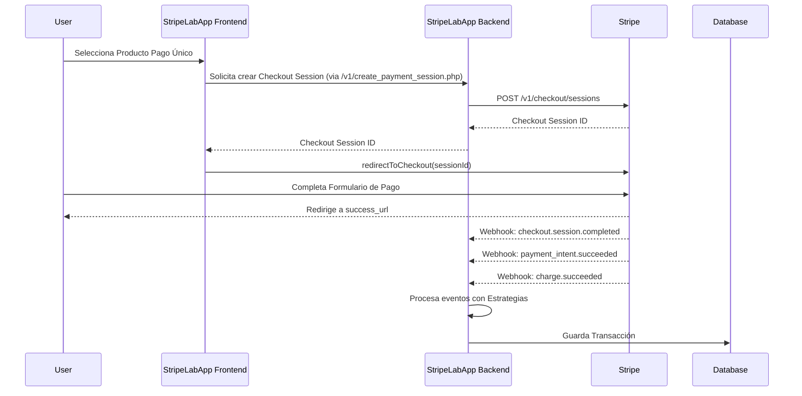
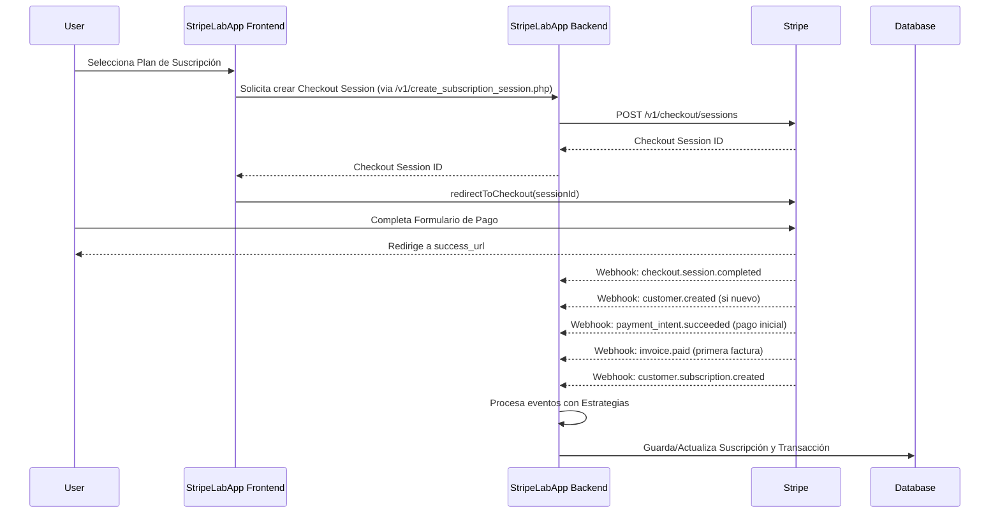
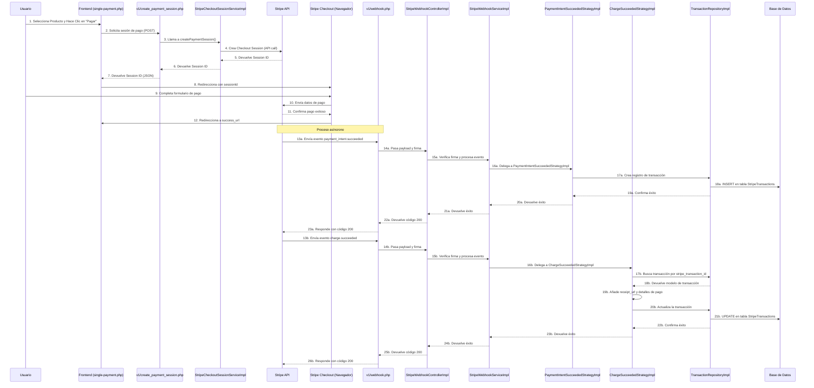
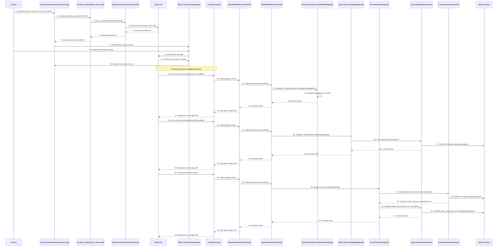

# Documentación de StripeLabApp

## PARTE I: Entendiendo la Integración con Stripe API

Esta sección cubre los conceptos fundamentales de Stripe y cómo se integran en StripeLabApp.

### 1. Introducción a Stripe para Desarrolladores

Stripe es una plataforma tecnológica de pagos que permite a empresas de todos los tamaños aceptar pagos y gestionar sus negocios en línea. A diferencia de otras soluciones de pago, Stripe está diseñado específicamente para desarrolladores, ofreciendo:

*   **APIs robustas y bien documentadas** que facilitan la integración.
*   **Soporte para múltiples métodos de pago**
*   **Herramientas de seguridad avanzadas** con cumplimiento PCI DSS nivel 1.
*   **Gestión completa de suscripciones** y modelos de negocio recurrentes.
*   **Detección de fraudes** mediante Stripe Radar.
*   **Panel de control intuitivo** para monitoreo y gestión de transacciones.

Para desarrolladores, Stripe proporciona bibliotecas cliente en los principales lenguajes de programación, webhooks para integraciones en tiempo real, y entornos de prueba completos que facilitan el desarrollo sin riesgos.

#### 1.2. Conceptos Clave de Stripe

Stripe está estructurado en torno a **objetos** que representan diferentes aspectos del proceso de pago. Entender estos objetos es crucial para trabajar eficientemente con la API:

**Customers (`cus_...`)**
Representan a los clientes de tu negocio. Los objetos Customer almacenan información de contacto, métodos de pago y metadatos personalizados. Son especialmente útiles para transacciones recurrentes y análisis de clientes.

**PaymentIntents (`pi_...`)**
Representan el intento de cobrar a un cliente. Gestionan todo el flujo de pago, incluyendo la autenticación 3D Secure y los reintentos automatizados. Es el objeto central para procesar pagos únicos de forma segura y cumpliendo con SCA (Strong Customer Authentication).

**SetupIntents (`seti_...`)**
Similar a PaymentIntents, pero diseñado para configurar métodos de pago para su uso futuro sin realizar un cargo inmediato. Ideal para suscripciones o cuando necesitas autorizar una tarjeta antes de cobrar.

**Charges (`ch_...`)**
Representan un cargo a una tarjeta u otra fuente de pago. Generalmente, es mejor usar PaymentIntents que interactuar directamente con Charges. En la API moderna de Stripe, los Charges se crean automáticamente a través de PaymentIntents.

**Invoices (`in_...`)**
Documentos que detallan los importes adeudados por un cliente. Las facturas pueden generarse manual o automáticamente (para suscripciones). Stripe puede enviar facturas por correo electrónico, intentar cobrarlas automáticamente, y seguimiento de pagos.

**Subscriptions (`sub_...`)**
Representan pagos recurrentes a intervalos regulares. Las suscripciones están vinculadas a un Customer y a un Price, y gestionan automáticamente la facturación recurrente, los ciclos de facturación, las actualizaciones/degradaciones, y los períodos de prueba.

**Products y Prices (`prod_...`, `price_...`, `lookup_key`)**
Los Products representan los bienes o servicios que ofreces. Los Prices definen cuánto y con qué frecuencia se cobra por un Product específico. Un producto puede tener múltiples precios (por ejemplo, mensual vs. anual). El `lookup_key` permite identificar fácilmente un Price específico en tu código.

**Checkout Sessions (`cs_...`)**
Representan una instancia de la página de pago alojada por Stripe (Stripe Checkout). Proporcionan una experiencia de pago optimizada sin necesidad de crear formularios personalizados. Las Checkout Sessions pueden configurarse para pagos únicos o suscripciones.

**Events (`evt_...`)**
Notificaciones que Stripe envía cuando ocurre algo en tu cuenta. Los eventos son fundamentales para crear integraciones asíncronas mediante webhooks. Cada tipo de evento tiene un formato específico y contiene datos sobre el objeto afectado.

#### 1.3. Claves API (Publicable y Secreta)
Stripe utiliza un sistema de autenticación basado en claves API para identificar quién está realizando solicitudes. Existen dos tipos principales de claves:

**Clave Publicable (pk_...)**
*   **Uso:** En el Frontend.
*   **Propósito:** Identifica tu cuenta Stripe pero no permite acciones sensibles. Se utiliza principalmente con Stripe.js para recopilar información de pago de forma segura.
*   *Segura para exponer en el código del navegador.*

**Clave Secreta (sk_...)**
*   **Uso:** Exclusivamente en el servidor.
*   **Propósito:** Otorga acceso completo a tu cuenta de Stripe. Permite crear cargos, gestionar clientes, acceder a datos sensibles, y realizar cualquier operación con la API.
*   *Nunca debe ser expuesta al frontend o en repositorios públicos.*

Ambos tipos de claves tienen versiones para entorno de prueba (prefijo `pk_test_` y `sk_test_`) y producción (prefijo `pk_live_` y `sk_live_`). Las claves de prueba permiten simular todas las funcionalidades sin procesar pagos reales.

*Buena práctica: Almacena las claves secretas en variables de entorno o en un sistema seguro de gestión de secretos, nunca en archivos de configuración que puedan ser comprometidos.*

### 2. Webhooks de Stripe

#### 2.1. ¿Qué son los Webhooks y por qué son cruciales?
Los webhooks son notificaciones **HTTP POST que Stripe envía a tu servidor cuando ocurren eventos** en tu cuenta. Funcionan como un sistema de "notificaciones push" para la aplicación, permitiendo la comunicación asíncrona entre Stripe y el backend.

**¿Por qué son cruciales los webhooks?**
*   **Procesamiento asíncrono:** Muchas operaciones de pago no son instantáneas.
*   **Fiabilidad:** Garantizan que tu aplicación reciba actualizaciones.
*   **Actualizaciones en tiempo real:** Permiten que tu aplicación reaccione inmediatamente.
*   **Gestión de errores:** Notifican sobre fallos en los pagos.

**Casos de uso esenciales**
*   Actualizar el estado de la suscripción.
*   Enviar confirmaciones de pago.
*   Activar acceso a servicios.
*   Gestionar pagos fallidos.
*   Registrar eventos financieros.
*   Reaccionar ante disputas.

En StripeLabApp, los webhooks son el mecanismo principal para mantener sincronizados nuestros registros con los eventos de pago.

#### 2.2. Seguridad de los Webhooks
Los webhooks son endpoints públicos, por lo que su seguridad es crítica.

**Verificación de Firmas (Webhook Secret)**
Cada webhook incluye una firma criptográfica.
*Importante: La verificación de firma es esencial para prevenir ataques de suplantación.*
Proceso de verificación:
1.  Stripe proporciona un "Webhook Secret".
2.  Cada evento incluye un encabezado `Stripe-Signature`.
3.  Tu servidor verifica esta firma.

**HTTPS**
Stripe requiere HTTPS para garantizar la transmisión cifrada.
*Requisito: El servidor debe tener un certificado SSL válido.*

*Advertencia: Nunca almacenes el Webhook Secret en archivos públicos.*

#### 2.3. Reintentos y Mejores Prácticas para la Respuesta del Endpoint
Stripe reintenta la entrega de webhooks si tu servidor no responde con un código 2xx.

**Política de reintentos de Stripe**
*   Reintentos durante 3 días.
*   Frecuencia aproximada: cada hora, con esquema exponencial.
*   El mismo evento puede enviarse múltiples veces.

**Respuestas correctas del endpoint**
*   Buenas respuestas (evitan reintentos): HTTP 200, HTTP 204.
*   Respuestas que provocan reintentos: HTTP 4xx (excepto 409), HTTP 5xx, Timeout.

**Mejores prácticas para el procesamiento de webhooks**
1.  **Implementa idempotencia:** Maneja el mismo evento múltiples veces sin efectos indeseados (usar ID del evento).
2.  **Respuesta rápida:** Responde 200 lo antes posible.
3.  **Manejo de errores robusto:** Si un error persistirá, responde 200 pero regístralo.
4.  **Registro detallado:** Guarda los webhooks recibidos.
5.  **Monitoreo activo:** Configura alertas para eventos fallidos.
    *Consejo: En StripeLabApp, se usa el patrón Strategy para procesar eventos.*

### 3. Eventos de Stripe: Tipos y Uso

#### 3.1. Anatomía de un Objeto Evento de Stripe
Los eventos de Stripe son objetos JSON con una estructura específica.
Campos clave:
*   `id`: Identificador único del evento (`evt_...`).
*   `type`: Especifica qué ha ocurrido (ej. `payment_intent.succeeded`).
*   `data.object`: Contiene el objeto completo relacionado con el evento.
*   `data.previous_attributes`: (Solo en eventos de actualización) Valores anteriores de campos modificados.
*   `livemode`: `true` para producción, `false` para prueba.
    *Consejo de implementación: En StripeLabApp, se mapean estos eventos a DTOs.*

#### 3.2. Categorías Principales de Eventos
Stripe agrupa eventos por recurso afectado.

| Categoría             | Prefijo del evento        | Descripción                                           | Eventos típicos                                                                 |
| --------------------- | ------------------------- | ----------------------------------------------------- | ------------------------------------------------------------------------------- |
| **Charges**           | `charge.`                 | Eventos relacionados con cargos a métodos de pago.    | `charge.succeeded`, `charge.failed`, `charge.refunded`                          |
| **Payment Intents**   | `payment_intent.`         | Eventos del ciclo de vida de intentos de pago.        | `payment_intent.created`, `payment_intent.succeeded`, `payment_intent.payment_failed` |
| **Checkout Sessions** | `checkout.session.`       | Eventos de sesiones de Stripe Checkout.               | `checkout.session.completed`, `checkout.session.expired`                        |
| **Customers**         | `customer.`               | Eventos de creación y modificación de clientes.       | `customer.created`, `customer.updated`, `customer.deleted`                      |
| **Subscriptions**     | `customer.subscription.`  | Eventos del ciclo de vida de suscripciones.           | `customer.subscription.created`, `customer.subscription.updated`, `customer.subscription.deleted` |
| **Invoices**          | `invoice.`                | Eventos de facturas, principalmente para suscripciones. | `invoice.created`, `invoice.paid`, `invoice.payment_failed`                     |

*Nota: Stripe puede añadir nuevos tipos de eventos.*
En StripeLabApp, nos enfocamos en eventos de pagos únicos y suscripciones.

#### 3.3. Eventos Detallados
Análisis de los eventos más importantes manejados en StripeLabApp.

**Checkout**
Eventos sobre el proceso de pago mediante Stripe Checkout.

*   `checkout.session.completed`
    *   *Descripción:* Se dispara cuando un cliente completa el proceso de pago en Stripe Checkout. Crucial para activar productos/servicios.
    *   Contiene: Detalles del cliente, monto, modo ("payment" o "subscription"), estado del pago, referencias a `payment_intent`, `subscription`, `invoice`.
    *   *Implementación en StripeLabApp:* Usado para crear transacciones y activar suscripciones.

*   `checkout.session.expired`
    *   *Descripción:* Se dispara cuando una sesión de Checkout expira.
    *   Útil para: Limpiar recursos, enviar recordatorios, análisis de abandono.

**Clientes (Customers)**
Eventos sobre cambios en objetos Customer.

*   `customer.created`
    *   *Descripción:* Se dispara al crear un nuevo cliente.
    *   Payload incluye: Información de contacto, dirección, configuración de facturación.
    *   *Implementación en StripeLabApp:* Sincronizar datos del cliente.

*   `customer.updated`
    *   *Descripción:* Se dispara al actualizar información del cliente.
    *   Útil para mantener sincronizada la información. Payload incluye `previous_attributes`.

*   `customer.deleted`
    *   *Descripción:* Se dispara al eliminar un cliente. En StripeLabApp, se usa para marcar al cliente como inactivo.

**Pagos (PaymentIntents & Charges)**
Eventos para rastrear el estado de las transacciones.

*   `payment_intent.created`
    *   *Descripción:* Se dispara al crear un PaymentIntent. En StripeLabApp no se procesa activamente.

*   `payment_intent.succeeded`
    *   *Descripción:* Uno de los eventos más importantes, confirma un pago exitoso.
    *   Payload contiene: Monto, moneda, cliente, método de pago, `latest_charge`.
    *   *Implementación en StripeLabApp:* Usado para registrar transacciones exitosas.

*   `payment_intent.payment_failed`
    *   *Descripción:* Se dispara cuando un intento de pago falla.

*   `charge.succeeded`
    *   *Descripción:* Se dispara cuando un cargo se procesa correctamente. Relacionado con `payment_intent.succeeded`.
    *   Importancia: Contiene `receipt_url`, detalles del método de pago, resultados de verificaciones.
    *   *Implementación en StripeLabApp:* Obtener `receipt_url`.

*   `charge.failed` y `charge.refunded`
    *   *Descripción:* `charge.failed` para cargos fallidos. `charge.refunded` para reembolsos.

*Consideraciones importantes: Los eventos pueden llegar en cualquier orden.*

**Facturas (Invoices)**
Eventos para gestionar y rastrear pagos, especialmente en suscripciones.

*   `invoice.created`
    *   *Descripción:* Se dispara al crear una factura. En StripeLabApp no se procesa activamente, se prioriza `invoice.paid`.

*   `invoice.paid`
    *   *Descripción:* Evento crucial, se dispara cuando se paga una factura. Confirma pagos recurrentes.
    *   Payload contiene: Detalles de líneas, `hosted_invoice_url`, `invoice_pdf`, periodo, cliente y suscripción.
    *   *Implementación en StripeLabApp:* Actualizar registros de pago y visualizar recibos.

*   Otros eventos de facturación:
    *   `invoice.payment_failed`: Para pagos de factura fallidos.
    *   `invoice.finalized`: Factura finalizada y lista para pago.
    *   `invoice.upcoming`: Notifica sobre una próxima factura.

**Suscripciones (Subscriptions)**
Eventos para gestionar el ciclo de vida de las suscripciones.

*   `customer.subscription.created`
    *   *Descripción:* Se dispara al crear una nueva suscripción.
    *   Payload contiene: Plan, precio, ciclo de facturación, estado, método de pago, `latest_invoice`.
    *   *Implementación en StripeLabApp:* Crear un nuevo registro de suscripción.

*   `customer.subscription.updated`
    *   *Descripción:* Se dispara al actualizar una suscripción (plan, cantidad, método de pago, cancelación programada).
    *   Importante para: Cambios de plan, cancelaciones con `cancel_at_period_end: true`, cambios de estado.
    *   *Implementación en StripeLabApp:* Actualizar registros, indicar cancelación al final del periodo.

*   `customer.subscription.deleted`
    *   *Descripción:* Se dispara con cancelación inmediata o al finalizar un periodo previamente programado para cancelación.
    *   Importante diferenciar: cancelación inmediata vs. finalización de cancelación programada.
    *   *Implementación en StripeLabApp:* Actualizar estado de suscripción, marcar como cancelada inmediatamente.

*   `customer.subscription.trial_will_end`
    *   *Descripción:* Se dispara antes de que finalice un periodo de prueba.

**Productos y Precios (Informativo)**
Eventos generalmente no procesados activamente si el catálogo se gestiona en el Dashboard de Stripe.
*   `product.created`, `product.updated`
*   `price.created`, `price.updated`
*   *En StripeLabApp, no se procesan estos eventos. Se considera su uso futuro para integraciones.*

#### 3.4. Orden de los Eventos y Flujos Comunes
Stripe envía eventos en orden, pero la entrega asíncrona requiere diseñar para manejar eventos fuera de secuencia o duplicados.
*Importante: Los diagramas representan el orden habitual, pero pueden variar.*


**Flujo de pago único**



**Flujo de nueva suscripción**




*Consejo (Nueva Suscripción): En StripeLabApp, `checkout.session.completed` activa la suscripción, otros eventos actualizan y confirman.*


*Consejo (Pago Único): `checkout.session.completed` registra la transacción, `charge.succeeded` añade `receipt_url`.*

### 4. Stripe CLI: Herramienta Esencial para Desarrollo y Pruebas

#### 4.1. ¿Qué es Stripe CLI y por qué es útil?
Stripe CLI (Command Line Interface) es una herramienta oficial que simplifica el desarrollo y pruebas con Stripe, especialmente webhooks.

**Funcionalidades principales:**

*   Reenvío de webhooks a servidores locales.
*   Activador de eventos de prueba.
*   Interacción directa con la API.
*   Logs en tiempo real.
*   Depuración.


**Beneficios para el desarrollo:**

*   Desarrollo local sin exponer localhost.
*   Ciclo de retroalimentación rápido.
*   Simulación completa de flujos.

**Instalación:**

*   macOS (Homebrew): `brew install stripe/stripe-cli/stripe`
*   Windows (scoop): `scoop bucket add stripe ...` y `scoop install stripe`
    *Nota: Ver documentación oficial para detalles.*

#### 4.2. Configuración y Autenticación
Autenticar con tu cuenta de Stripe:

1.  `stripe login`
2.  Autorizar en el navegador.
3.  Verificar con `stripe status`.
    *Seguridad: Se generan claves API restringidas y temporales.*

Configuración del modo (test/live):

`stripe config set default_mode test`
`stripe config list`
*Precaución: Usar modo `live` con cuidado extremo.*

#### 4.3. Reenvío de Webhooks y Pruebas Locales
Reenvía webhooks a tu servidor local.
Comando: `stripe listen --forward-to http://localhost:8000/public/v1/webhook.php`
Proceso:

1.  Se suscribe a eventos de prueba.
2.  Recibe eventos en tiempo real.
3.  Reenvía a tu URL local.
    *Webhook signing secret: Stripe CLI genera un secreto temporal para usar en tu app.*
    Opciones útiles: `--events`, `--skip-verify`, `--latest`, `--log-level=debug`.

Simulación de eventos:
Permite probar sin acciones reales.
Comando: `stripe trigger [evento]`
Ejemplos: `stripe trigger payment_intent.succeeded`
*Combinar `stripe listen` y `stripe trigger` para probar flujos.*
*Consejo: Personalizar payload con `--add`.*
*Beneficio clave: Desarrollo y depuración rápidos y eficientes.*

#### 4.4. Otros Comandos Útiles para el Desarrollo
| Categoría                     | Comando                                      | Descripción                                  |
| ----------------------------- | -------------------------------------------- | -------------------------------------------- |
| **Exploración de la API**     | `stripe get /v1/customers`                   | Lista clientes.                              |
|                               | `stripe get /v1/subscriptions/sub_123`       | Detalles de una suscripción.                 |
|                               | `stripe get /v1/events --limit=5`            | Lista los 5 eventos más recientes.           |
| **Creación y modificación** | `stripe post /v1/customers -d name="Test"`   | Crea un cliente.                             |
|                               | `stripe post /v1/refunds -d charge=ch_123`   | Reembolsa un cargo.                          |
|                               | `stripe delete /v1/customers/cus_123`        | Elimina un cliente.                          |
| **Depuración**                | `stripe logs tail`                           | Logs de API en tiempo real.                  |
|                               | `stripe logs list`                           | Lista solicitudes recientes.                 |
| **Datos de prueba**           | `stripe fixtures`                            | Crea objetos de prueba.                      |
|                               | `stripe samples create accept-a-card-payment`| Descarga ejemplos de integración.            |
*Lista completa: `stripe help` o documentación de referencia.*

En StripeLabApp, Stripe CLI se usa para:
*   Reenviar webhooks (`stripe listen`).
*   Probar eventos (`stripe trigger`).
*   Monitorear logs (`stripe listen ... --log-level=debug`) (FUNDAMENTAL).

*Resumen: Stripe CLI es indispensable para desarrolladores Stripe.*

## PARTE II: Arquitectura de StripeLabApp
Esta sección explora la arquitectura, configuración y funcionamiento interno de StripeLabApp.

### 5. Introducción a StripeLabApp

#### 5.1. Objetivos del Proyecto
Proyecto para comprender la API de Stripe y aplicar conocimientos para un plugin.
Objetivos principales:
*   Entorno de aprendizaje.
*   Demostración de integración completa (pagos únicos, suscripciones).
*   Gestión robusta de webhooks.
*   Arquitectura modular y extensible.
*   Referencia de implementación segura.

#### 5.2. Funcionalidades Implementadas
*   **Pagos Únicos y Suscripciones:** Páginas de pago, integración con Stripe, manejo de eventos (`checkout.session.completed`, `payment_intent.succeeded`, `customer.subscription.created`, `invoice.paid`), acceso a recibos, visualización y cancelación de suscripciones.
*   **Eventos Manejados:** `checkout.session.completed`, `customer.created/updated`, `payment_intent.succeeded`, `charge.succeeded`, `customer.subscription.created/updated/deleted`, `invoice.paid`.
*   **Gestión de Webhooks:** Endpoint único, verificación de firmas, sistema de estrategias, manejo de idempotencia, logging, gestión de errores.
*   **Interfaz y Utilidades:** Paneles para facturas y suscripciones, APIs de datos, interfaz Bootstrap, mensajes de confirmación/error, sistema de logs.
    *Alcance: Enfocado en aspectos técnicos, carece de autenticación de usuarios completa, roles, o panel de admin avanzado.*

#### 5.3. Estructura de Directorios del Proyecto
(Aquí se insertaría el árbol de directorios)
Estructura en capas: Interfaz de usuario (`public/`), Controladores, Servicios, Repositorios, Modelos/DTOs.
*Ventajas: Separación de responsabilidades, testabilidad, extensibilidad.*

        ```mermaid
        graph TD
        Root[StripeLabApp] --> Config[config/]
        Root --> Database[database/]
        Root --> Logs[logs/]
        Root --> Public[public/]
        Root --> Src[src/]
        Root --> EnvFile[.env]
        Root --> GitignoreFile[.gitignore]
        Root --> ComposerFile[composer.json]
        Root --> ReadmeFile[README.md]
        Root --> IndexHtml[index.html]
        
            %% Config files
            Config --> Bootstrap[Bootstrap.php]
            Config --> ConfigFile[config.php]
            Config --> DatabaseConnection[DatabaseConnection.php]
            
            %% Database files
            Database --> Docker[docker/docker-compose.yml]
            
            %% Public directory structure
            Public --> IndexPhp[index.php]
            Public --> SinglePayment[single-payment.php]
            Public --> SubscriptionsPayment[subscriptions-payment.php]
            Public --> ViewSubscriptions[view-subscriptions.php]
            Public --> Invoices[invoices.php]
            Public --> Assets[assets/]
            Public --> Api[api/]
            Public --> V1[v1/]
            
            %% API endpoints
            Api --> ApiInvoices[api-invoices.php]
            Api --> ApiSubscriptions[api-subscriptions.php]
            Api --> ApiManageSubscription[api-manage-subscription.php]
            
            %% V1 endpoints
            V1 --> CreatePaymentSession[create_payment_session.php]
            V1 --> CreateSubscriptionSession[create_subscription_session.php]
            V1 --> Webhook[webhook.php]
            
            %% Source directory structure
            Src --> Controllers[Controller/]
            Src --> Services[Service/]
            Src --> Strategies[Strategy/]
            Src --> Repositories[Repository/]
            Src --> Mappers[Mappers/]
            Src --> Factories[Factories/]
            Src --> Models[Models/]
            Src --> DTOs[DTOs/]
            Src --> Enums[Enums/]
            Src --> Exceptions[Exceptions/]
            Src --> Loggers[Logger/]
            
            %% Controllers
            Controllers --> ControllerImpl[Impl/]
            Controllers --> WebhookControllerInterface[StripeWebhookControllerInterface.php]
            Controllers --> SubscriptionControllerInterface[StripeSubscriptionControllerInterface.php]
            Controllers --> InvoiceControllerInterface[StripeInvoiceControllerInterface.php]
            
            %% Services
            Services --> ServiceImpl[Impl/]
            Services --> WebhookServiceInterface[StripeWebhookServiceInterface.php]
            Services --> CheckoutServiceInterface[StripeCheckoutSessionServiceInterface.php]
            Services --> SubscriptionManagementInterface[StripeSubscriptionManagementServiceInterface.php]
            
            %% Strategies
            Strategies --> StrategyImpl[Impl/]
            Strategies --> StrategyInterface[StripeWebhookStrategyInterface.php]
            
            %% Strategy implementations
            StrategyImpl --> StripeEventStrategyInterfaceImpl[StripeEventStrategyInterfaceImpl.php]
            StrategyImpl --> SubscriptionCreatedStrategyImpl[SubscriptionCreatedStrategyImpl.php]
            StrategyImpl --> SubscriptionDeletedStrategyImpl[SubscriptionDeletedStrategyImpl.php]
            StrategyImpl --> SubscriptionUpdatedStrategyImpl[SubscriptionUpdatedStrategyImpl.php]
            StrategyImpl --> CheckoutSessionCompletedStrategyImpl[CheckoutSessionCompletedStrategyImpl.php]
            StrategyImpl --> PaymentIntentSucceededStrategyImpl[PaymentIntentSucceededStrategyImpl.php]
            StrategyImpl --> CustomerCreatedOrUpdatedStrategyImpl[CustomerCreatedOrUpdatedStrategyImpl]
            StrategyImpl --> InvoicePaidStrategyImpl[InvoicePaidStrategyImpl.php]
            StrategyImpl --> ChargeSucceededStrategyImpl[ChargeSucceededStrategyImpl.php]
            
            %% Repositories
            Repositories --> RepositoryImpl[Impl/]
            Repositories --> TransactionRepositoryInterface[TransactionRepositoryInterface.php]
            Repositories --> InvoiceRepositoryInterface[InvoiceRepositoryInterface.php]
            Repositories --> SubscriptionRepositoryInterface[SubscriptionRepositoryInterface.php]
            
            %% Mappers
            Mappers --> ChargeMapper[ChargeMapper.php]
            Mappers --> CheckoutSessionMapper[CheckoutSessionMapper.php]
            Mappers --> CustomerMapper[CustomerMapper.php]
            Mappers --> InvoiceMapper[InvoiceMapper.php]
            Mappers --> PaymentIntentMapper[PaymentIntentMapper.php]
            Mappers --> SubscriptionMapper[SubscriptionMapper.php]
            
            %% Factories
            Factories --> TransactionModelFactory[TransactionModelFactory.php]
            Factories --> SubscriptionModelFactory[SubscriptionModelFactory.php]
            
            %% Models
            Models --> TransactionsModel[TransactionsModel.php]
            Models --> SubscriptionsModel[SubscriptionsModel.php]
            
            %% DTOs
            DTOs --> TransactionDTO[TransactionDTO.php]
            DTOs --> SubscriptionDTO[SubscriptionDTO.php]
            DTOs --> InvoiceDTO[InvoiceDTO.php]
            
            %% Enums
            Enums --> StripeEventTypeEnum[StripeEventTypeEnum.php]
            Enums --> TransactionTypeEnum[TransactionTypeEnum.php]
            
            %% Exceptions
            Exceptions --> ConfigurationException[ConfigurationException.php]
            Exceptions --> DatabaseException[DatabaseException.php]
            Exceptions --> InvalidWebhookPayloadException[InvalidWebhookPayloadException.php]
            Exceptions --> WebhookProcessingException[WebhookProcessingException.php]
            
            %% Loggers
            Loggers --> EventLogger[EventLogger.php]
            Loggers --> ErrorLogger[ErrorLogger.php]
            Loggers --> DatabaseLogger[DatabaseLogger.php]
            Loggers --> StripePayloadLogger[StripePayloadLogger.php]
            Loggers --> UnhandledStripeEventLogger[UnhandledStripeEventLogger.php]
            
            %% Styling
            classDef rootNode fill:#D5F5E3,stroke:#2ECC71,stroke-width:2px;
            classDef directoryNode fill:#D6EAF8,stroke:#3498DB;
            classDef fileNode fill:#FADBD8,stroke:#E74C3C;
            classDef interfaceNode fill:#FCF3CF,stroke:#F39C12;
            classDef implNode fill:#F5EEF8,stroke:#8E44AD;
            
            class Root rootNode;
            class Config,Database,Logs,Public,Src,Api,V1,Controllers,Services,Strategies,Repositories,Mappers,Factories,Models,DTOs,Enums,Exceptions,Loggers,ControllerImpl,ServiceImpl,StrategyImpl,RepositoryImpl directoryNode;
            class EnvFile,GitignoreFile,ComposerFile,ReadmeFile,Bootstrap,ConfigFile,DatabaseConnection,Docker,IndexPhp,SinglePayment,SubscriptionsPayment,ViewSubscriptions,Invoices,Assets,ApiInvoices,ApiSubscriptions,ApiManageSubscription,CreatePaymentSession,CreateSubscriptionSession,Webhook,IndexHtml fileNode;
            class WebhookControllerInterface,SubscriptionControllerInterface,InvoiceControllerInterface,WebhookServiceInterface,CheckoutServiceInterface,SubscriptionManagementInterface,StrategyInterface,TransactionRepositoryInterface,InvoiceRepositoryInterface,SubscriptionRepositoryInterface interfaceNode;
            class StripeEventStrategyInterfaceImpl,SubscriptionCreatedStrategyImpl,SubscriptionDeletedStrategyImpl,SubscriptionUpdatedStrategyImpl,CheckoutSessionCompletedStrategyImpl,PaymentIntentSucceededStrategyImpl,CustomerCreatedOrUpdatedStrategyImpl,InvoicePaidStrategyImpl,ChargeSucceededStrategyImpl implNode;
    ```

### 6. Configuración y Puesta en Marcha de StripeLabApp

#### 6.1. Requisitos Específicos de la Aplicación
*   **Software:** PHP 8.0+, Composer, MySQL, Stripe CLI, Servidor web.
*   **Stripe:** Cuenta, claves API de prueba, productos/precios configurados, endpoint de webhook.
    *Recomendación: Usar Docker para desarrollo.*

#### 6.2. Guía de Instalación
1.  **Clonar:** `git clone https://github.com/JosCarRub/StripeLabApp.git`, `cd StripeLabApp`.
2.  **Dependencias:** `composer install` (instala `stripe/stripe-php`, `vlucas/phpdotenv`).
3.  **Variables de Entorno (`.env`):** Copiar `.env.example`, editar con credenciales de BD, claves de Stripe, IDs de productos/precios, URLs de redirección, configuración de logs. *Importante: No subir `.env` a repositorios públicos.*
4.  **Base de Datos (Docker):**
    1.  Desde `database/docker/`, ejecutar `docker-compose up -d`.
    2.  Entrar al contenedor: `docker exec -it stripe_mysql bash`.
    3.  Conectar a MySQL: `mysql -u test_user -p`.
    4.  Ejecutar SQL de `database/tables.txt` para crear tablas `StripeTransactions` y `StripeSubscriptions`.
5.  **Iniciar Servidor:** `php -S localhost:8000` (o configurar Apache/Nginx con `public/` como raíz). Acceder en `http://localhost:8000`.
6.  **Verificar:** Acceder a la app, probar conexiones, revisar logs si hay errores.

#### 6.3. Configuración del Endpoint de Webhook para StripeLabApp
**Opción 1: Desarrollo local con Stripe CLI**
1.  Stripe CLI instalado y autenticado.
2.  Iniciar reenvío: `stripe listen --forward-to http://localhost:8000/public/v1/webhook.php`.
3.  Copiar el `whsec_...` de Stripe CLI a `STRIPE_WEBHOOK_SECRET` en `.env`.
    *Ventaja: Pruebas locales sin exponer servidor, simulación de eventos con `stripe trigger`.*

Con estos pasos, StripeLabApp está lista para procesar pagos y webhooks.

### 7. Arquitectura Detallada de StripeLabApp

#### 7.1. Diagrama de Componentes de StripeLabApp

StripeLabApp sigue una arquitectura en capas.

**Diagrama de componentes y flujo completo de la aplicación**

                                    flowchart TD
                                    %% Usuarios y Puntos de entrada
                                    User([Usuario]):::user

                                    %% Páginas de entrada
                                    User -->|Accede| Index["/index.php"]:::frontend
                                    Index -->|Selecciona| Single["/single-payment.php"]:::frontend
                                    Index -->|Selecciona| Subscriptions["/subscriptions-payment.php"]:::frontend

                                    %% Flujo de Pago Único
                                    Single -->|onClick| SinglePaymentJS["subscription-payment.js\nfetch()"]:::frontend
                                    SinglePaymentJS -->|POST| CreatePaymentSession["/v1/create_payment_session.php"]:::api

                                    %% Flujo de Suscripción
                                    Subscriptions -->|onClick| SubscriptionPaymentJS["subscription-payment.js\nfetch()"]:::frontend
                                    SubscriptionPaymentJS -->|POST| CreateSubscriptionSession["/v1/create_subscription_session.php"]:::api

                                    %% Servicios de Checkout
                                    CreatePaymentSession -->|instancia| CheckoutService["StripeCheckoutSessionServiceImpl"]:::service
                                    CreateSubscriptionSession -->|instancia| CheckoutService
                                    CheckoutService -->|API call| StripeAPI[("Stripe API")]:::external

                                    %% Redirección y Checkout de Stripe
                                    StripeAPI -->|redirect_to| StripeCheckout["Stripe Checkout\nFormulario de Pago"]:::external
                                    StripeCheckout -->|success_url| SuccessPage["/success.html"]:::frontend
                                    StripeCheckout -->|cancel_url| CancelPage["/cancel.html"]:::frontend

                                    %% Flujo de Webhook
                                    StripeAPI -->|Envía eventos| WebhookEndpoint["/v1/webhook.php"]:::api
                                    WebhookEndpoint -->|instancia| WebhookController["StripeWebhookControllerImpl"]:::controller
                                    WebhookController -->|procesa| WebhookService["StripeWebhookServiceImpl"]:::service
                                    WebhookService -->|verifica firma| StripeSig{{"¿Firma válida?"}}:::decision

                                    %% Logging de Payloads
                                    WebhookService -->|registra| PayloadLogger["StripePayloadLogger"]:::logger
                                    StripeSig -->|No| ErrorLogger["ErrorLogger"]:::logger

                                    %% Selección e implementación de estrategias
                                    StripeSig -->|Sí| EventType{{"Tipo de evento"}}:::decision

                                    %% Estrategias específicas
                                    EventType -->|checkout.session.completed| CheckoutStrategy["CheckoutSessionCompletedStrategyImpl"]:::strategy
                                    EventType -->|payment_intent.succeeded| PaymentIntentStrategy["PaymentIntentSucceededStrategyImpl"]:::strategy
                                    EventType -->|charge.succeeded| ChargeStrategy["ChargeSucceededStrategyImpl"]:::strategy
                                    EventType -->|customer.subscription.created| SubCreatedStrategy["SubscriptionCreatedStrategyImpl"]:::strategy
                                    EventType -->|customer.subscription.updated| SubUpdatedStrategy["SubscriptionUpdatedStrategyImpl"]:::strategy
                                    EventType -->|customer.subscription.deleted| SubDeletedStrategy["SubscriptionDeletedStrategyImpl"]:::strategy
                                    EventType -->|invoice.paid| InvoicePaidStrategy["InvoicePaidStrategyImpl"]:::strategy
                                    EventType -->|customer.created/updated| CustomerStrategy["CustomerCreatedOrUpdatedStrategyImpl"]:::strategy
                                    EventType -->|otros| UnhandledLogger["UnhandledStripeEventLogger"]:::logger

                                    %% Mapeo de datos
                                    CheckoutStrategy -->|usa| CheckoutMapper["CheckoutSessionMapper"]:::mapper
                                    PaymentIntentStrategy -->|usa| PaymentIntentMapper["PaymentIntentMapper"]:::mapper
                                    ChargeStrategy -->|usa| ChargeMapper["ChargeMapper"]:::mapper
                                    SubCreatedStrategy & SubUpdatedStrategy & SubDeletedStrategy -->|usa| SubscriptionMapper["SubscriptionMapper"]:::mapper
                                    InvoicePaidStrategy -->|usa| InvoiceMapper["InvoiceMapper"]:::mapper
                                    CustomerStrategy -->|usa| CustomerMapper["CustomerMapper"]:::mapper

                                    %% DTOs
                                    CheckoutMapper -->|crea| CheckoutDTO["CheckoutSessionCompletedDTO"]:::dto
                                    PaymentIntentMapper -->|crea| PaymentIntentDTO["PaymentIntentDTO"]:::dto
                                    ChargeMapper -->|crea| ChargeDTO["ChargeDTO"]:::dto
                                    SubscriptionMapper -->|crea| SubscriptionDTO["SubscriptionDTO"]:::dto
                                    InvoiceMapper -->|crea| InvoiceDTO["InvoiceDTO"]:::dto
                                    CustomerMapper -->|crea| CustomerDTO["CustomerDTO"]:::dto

                                    %% Factories y creación de modelos
                                    PaymentIntentStrategy & ChargeStrategy & InvoicePaidStrategy -->|usa| TransactionFactory["TransactionModelFactory"]:::factory
                                    SubCreatedStrategy & SubUpdatedStrategy & SubDeletedStrategy -->|usa| SubscriptionFactory["SubscriptionModelFactory"]:::factory

                                    %% Modelos/Entidades
                                    TransactionFactory -->|crea| TransactionModel["TransactionsModel"]:::entity
                                    SubscriptionFactory -->|crea| SubscriptionModel["SubscriptionsModel"]:::entity

                                    %% Repositorios
                                    TransactionModel -->|persistido por| TransactionRepo["TransactionRepositoryImpl"]:::repository
                                    SubscriptionModel -->|persistido por| SubscriptionRepo["SubscriptionRepositoryImpl"]:::repository
                                    InvoiceDTO -->|consultado por| InvoiceRepo["InvoiceRepositoryImpl"]:::repository

                                    %% Base de datos
                                    TransactionRepo & SubscriptionRepo & InvoiceRepo -->|operaciones| Database[("Base de Datos\nMySQL")]:::database

                                    %% Visualización de datos
                                    User -->|Consulta| InvoicesPage["/invoices.php"]:::frontend
                                    User -->|Consulta| SubscriptionsPage["/view-subscriptions.php"]:::frontend

                                    %% APIs para consultas
                                    InvoicesPage -->|fetch| ApiInvoices["/api/api-invoices.php"]:::api
                                    SubscriptionsPage -->|fetch| ApiSubscriptions["/api/api-subscriptions.php"]:::api
                                    SubscriptionsPage -->|administra| ApiManageSub["/api/api-manage-subscription.php"]:::api

                                    %% Controladores para visualización
                                    ApiInvoices -->|instancia| InvoiceController["StripeInvoiceControllerImpl"]:::controller
                                    ApiSubscriptions & ApiManageSub -->|instancia| SubscriptionController["StripeSubscriptionControllerImpl"]:::controller

                                    %% Servicios para gestión de suscripciones
                                    SubscriptionController -->|usa| SubscriptionService["StripeSubscriptionManagementServiceImpl"]:::service
                                    SubscriptionService -->|API call| StripeAPI

                                    %% Panel de administración
                                    User -->|Acceso admin| AdminPanel["/admin/panel.php"]:::frontend
                                    AdminPanel -->|fetch| PanelApi["/admin/api/panel_api.php"]:::api

                                    %% Definición de estilos
                                    classDef user fill:#ECF0F1,stroke:#95A5A6,stroke-width:2px,color:#34495E,font-weight:bold;
                                    classDef frontend fill:#D5F5E3,stroke:#2ECC71,stroke-width:2px,color:#27AE60;
                                    classDef api fill:#D6EAF8,stroke:#3498DB,stroke-width:2px,color:#2980B9;
                                    classDef controller fill:#E8DAEF,stroke:#8E44AD,stroke-width:2px,color:#8E44AD;
                                    classDef service fill:#FADBD8,stroke:#E74C3C,stroke-width:2px,color:#C0392B;
                                    classDef strategy fill:#FCF3CF,stroke:#F1C40F,stroke-width:2px,color:#F39C12;
                                    classDef mapper fill:#FEF9E7,stroke:#F7DC6F,stroke-width:2px,color:#D4AC0D;
                                    classDef dto fill:#FDEBD0,stroke:#F5B041,stroke-width:2px,color:#D35400;
                                    classDef factory fill:#EBDEF0,stroke:#A569BD,stroke-width:2px,color:#8E44AD;
                                    classDef entity fill:#D6DBDF,stroke:#85929E,stroke-width:2px,color:#2C3E50;
                                    classDef repository fill:#F4ECF7,stroke:#BB8FCE,stroke-width:2px,color:#8E44AD;
                                    classDef database fill:#E5E8E8,stroke:#99A3A4,stroke-width:2px,color:#2C3E50,font-weight:bold;
                                    classDef external fill:#F2D7D5,stroke:#EC7063,stroke-width:2px,color:#CB4335;
                                    classDef logger fill:#D0ECE7,stroke:#45B39D,stroke-width:2px,color:#16A085;
                                    classDef decision fill:#F5EEF8,stroke:#AF7AC5,stroke-width:2px,color:#8E44AD,shape:diamond;

#### 7.2.1 Capa Frontend
Diseñada para ser intuitiva, usando HTML, CSS, JavaScript.
**Componentes Frontend:**
*   `index.php`: Selección de pago único o suscripción.
*   `single-payment.php`: Para pago único.
*   `subscriptions-payment.php`: Para pagos de suscripciones.
*   `invoices.php`: Visualizar facturas.
*   `view-subscriptions.php`: Ver suscripciones.
  *   `admin/panel.php`: Visualizar tablas de BD.

        **Diagrama Frontend**
        ```mermaid
      graph TD
      %% Diagrama de componentes Frontend
      User([Usuario]):::user

                                      %% Páginas de entrada
                                      User -->|Accede| Index["/index.php"]:::frontend
                                      Index -->|Selecciona| Single["/single-payment.php"]:::frontend
                                      Index -->|Selecciona| Subscriptions["/subscriptions-payment.php"]:::frontend

                                      %% Flujo de Pago Único
                                      Single -->|onClick| SinglePaymentJS["subscription-payment.js\nfetch()"]:::frontend
                                      SinglePaymentJS -->|POST| CreatePaymentSession["/v1/create_payment_session.php"]:::api

                                      %% Flujo de Suscripción
                                      Subscriptions -->|onClick| SubscriptionPaymentJS["subscription-payment.js\nfetch()"]:::frontend
                                      SubscriptionPaymentJS -->|POST| CreateSubscriptionSession["/v1/create_subscription_session.php"]:::api

                                      %% Redirección y Checkout de Stripe
                                      StripeAPI[("Stripe API")]:::external
                                      StripeAPI -->|redirect_to| StripeCheckout["Stripe Checkout\nFormulario de Pago"]:::external
                                      StripeCheckout -->|success_url| SuccessPage["/success.html"]:::frontend
                                      StripeCheckout -->|cancel_url| CancelPage["/cancel.html"]:::frontend

                                      %% Visualización de datos
                                      User -->|Consulta| InvoicesPage["/invoices.php"]:::frontend
                                      User -->|Consulta| SubscriptionsPage["/view-subscriptions.php"]:::frontend

                                      %% APIs para consultas
                                      InvoicesPage -->|fetch| ApiInvoices["/api/api-invoices.php"]:::api
                                      SubscriptionsPage -->|fetch| ApiSubscriptions["/api/api-subscriptions.php"]:::api

                                      %% Panel de administración
                                      User -->|Acceso admin| AdminPanel["/admin/panel.php"]:::frontend

                                      %% Definición de estilos
                                      classDef user fill:#ECF0F1,stroke:#95A5A6,stroke-width:2px,color:#34495E,font-weight:bold;
                                      classDef frontend fill:#D5F5E3,stroke:#2ECC71,stroke-width:2px,color:#27AE60;
      ```


#### 7.2.2 Capa Backend
Robusta y escalable, gestiona lógica de negocio e interacción con API de Stripe. Dividida en Repository, Strategy, Factory para extensibilidad.
**Componentes Backend:**
*   **Controllers:** Reciben peticiones, delegan a servicios, manejan códigos HTTP.
*   **Services:** Orquestan validación y enrutamiento de webhooks, manejan excepciones.
*   **Repository:** Abstraen acceso a datos.
*   **Strategy:** Procesan eventos según tipo.
*   **Mappers:** Convierten Payloads a DTOs.
*   **Factory:** Transforman DTOs a Entidades.
*   **Commons:** Componentes transversales.

    *Nota: El logger es crucial para entender flujos y depurar.*

**Diagrama Backend**

     ```mermaid
            flowchart TD
                                StripeWebhookEvent[Evento Webhook de Stripe] -->|HTTP POST| A[public/v1/webhook.php]
                                A -->|Usa| B[config/Bootstrap]
                                B -->|Obtiene| C[StripeWebhookControllerImpl]
                                C -->| payload, signature| D[StripeWebhookServiceImpl  -constructEvent-]
                                D -- Devuelve Evento Stripe verificado --> C
                                C -->|2. Evento Stripe| E[StripeWebhookServiceImpl -processWebhookEvent-]
                                E -->|Loguea Payload| PL[StripePayloadLogger]
                                E -->|Itera y llama isApplicable| F{Selección de Estrategia}

                                subgraph "Proceso de Estrategia Aplicable"
                                    direction LR
                                    G[Estrategia Específica]
                                    G --> H[Mapper Específico]
                                    H --> I[DTO Específico]
                                    I --> J[Factory Específico]
                                    J --> K[Entidad/Modelo]
                                    K --> L[Repositorio Específico -save-]
                                    L --> M[(Base de Datos MySQL)]
                                end

                                F -- Evento Aplicable --> G
                                F -- Evento No Aplicable --> UL[UnhandledStripeEventLogger]

                                %% Estilos
                                classDef default fill:#fff,stroke:#333,stroke-width:1.5px;
                                classDef api fill:#D6EAF8,stroke:#3498DB;
                                classDef config fill:#FADBD8,stroke:#E74C3C;
                                classDef controller fill:#E8DAEF,stroke:#8E44AD;
                                classDef service fill:#D5F5E3,stroke:#2ECC71;
                                classDef strategy fill:#FCF3CF,stroke:#F1C40F,font-style:italic;
                                classDef mapper fill:#FEF9E7,stroke:#F7DC6F;
                                classDef dto fill:#FDEBD0,stroke:#F5B041;
                                classDef factory fill:#EBDEF0,stroke:#A569BD;
                                classDef entity fill:#D6DBDF,stroke:#85929E;
                                classDef repository fill:#F4ECF7,stroke:#BB8FCE;
                                classDef database fill:#E5E8E8,stroke:#99A3A4,font-weight:bold;
                                classDef logger fill:#D0ECE7,stroke:#45B39D;
                                classDef decision fill:#fff,stroke:#333,shape:diamond;

                                class A api
                                class B config
                                class C controller
                                class D,E service
                                class F decision
                                class G strategy
                                class H mapper
                                class I dto
                                class J factory
                                class K entity
                                class L repository
                                class M database
                                class PL,UL logger

      ```

    

#### 7.2.3 Capa Base de Datos
**Esquema de la Base de Datos**
Dos tablas principales: `StripeTransactions` y `StripeSubscriptions`.
*   **StripeTransactions:** Almacena pagos únicos y facturas de suscripción.
*   **StripeSubscriptions:** Registra información de suscripciones.
    Relación: `latest_transaction_id` en `StripeSubscriptions` referencia a `StripeTransactions`.

    *Nota: Mantener integridad referencial es importante.*

#### 7.3. Capa Commons
Componentes fundamentales.
**DTOs (Data Transfer Objects)**
Objetos simples e inmutables para transferir datos parseados de payloads de Stripe desde Mappers a Factories/Strategies. Desacoplan lógica de negocio de la estructura de API de Stripe.
Ejemplos: `SubscriptionDTO`, `InvoiceDTO`, `TransactionDTO`.
*Beneficio: Abstracción, facilita evolución, simplifica serialización JSON.*

**Entidades (Models)**
Representan objetos de dominio, corresponden a tablas BD.
*   `TransactionsModel`: Transacción financiera. `transaction_id` autoincremental.
*   `SubscriptionsModel`: Suscripción de cliente. `subscription_id` de Stripe es PK.
    *Relación con BD: Campos mapean a columnas.*

**Enums**
Tipado fuerte para constantes, mejoran legibilidad, reducen errores.
*   `StripeEventTypeEnum`: Tipos de eventos Stripe.
*   `TransactionTypeEnum`: Tipos de transacciones.
*   `SubscriptionStatusEnum` (Debería ser `TransactionStatusEnum` en la descripción original): Estados de transacción/suscripción.
    *Beneficio: Legibilidad, autocompletado, evita errores de strings, facilita evolución.*

**Excepciones Personalizadas**
Manejo específico y semántico de errores de la aplicación.
Ejemplos: `ConfigurationException`, `DatabaseException`, `InvalidWebhookPayloadException`, `WebhookProcessingException`.
*Nota: También se manejan excepciones nativas de `stripe-php`.*
Permiten manejo granular y respuestas específicas.

**Loggers**
Sistema especializado para depuración y auditoría.
*   `EventLogger`: Flujo general, inicializaciones, procesos.
*   `ErrorLogger`: Errores y excepciones con trazas.
*   `DatabaseLogger`: Operaciones BD críticas.
*   `StripePayloadLogger`: Payloads de Stripe (omitiendo datos sensibles).
*   `UnhandledStripeEventLogger`: Eventos Stripe sin estrategia.
    *Importancia: Crucial para auditar, detectar problemas, y reconciliación.*

#### 7.4. Capa de Configuración (config/)
Infraestructura básica para inicializar y gestionar dependencias.
**Bootstrap.php**
Service Locator simple, inicialización (carga `.env`, constantes), instanciación perezosa de dependencias.
*Enfoque: Más simple que un DIC completo, pero con beneficios similares.*
**DatabaseConnection.php**
Singleton para conexión PDO a MySQL. Establece conexión, configura opciones PDO, provee instancia a repositorios, maneja errores de conexión.
*Consideración: Para apps complejas, un DIC más sofisticado podría ser preferible.*

#### 7.5. Capa de Presentación y Puntos de Entrada (public/)
Puntos de entrada: páginas web, endpoints API, endpoint webhook.
**Páginas de Interfaz de Usuario**
*   Inicio de pagos: `index.php`, `single-payment.php`, `subscriptions-payment.php`.
*   Visualización/gestión: `invoices.php`, `view-subscriptions.php`.
    *Diseño: Bootstrap 5, JavaScript para AJAX.*
    **Endpoints de Checkout (`v1/`)**
*   `create_payment_session.php`: Crea sesión Checkout para pago único.
*   `create_subscription_session.php`: Crea sesión Checkout para suscripción.
    **Endpoint de Webhook (`v1/webhook.php`)**
    Punto de entrada crítico para webhooks de Stripe. Recibe payload, verifica firma, delega a `StripeWebhookController`.
    *Seguridad crítica: Verificación de firma esencial.*
    **Endpoints API (`api/`)**
*   `api-invoices.php`: Datos de facturas/recibos (`list_all`, `list_customer`).
*   `api-subscriptions.php`: Datos de suscripciones (`list_all_system`, `list_customer`).
*   `api-manage-subscription.php`: Gestión de suscripciones (cancelación).
    *Arquitectura: Validar entrada, delegar a servicios, devolver JSON.*

#### 7.6. Controladores (src/Controller/ e src/Controller/Impl/)
Coordinan flujo, reciben peticiones HTTP, delegan a servicios, devuelven respuestas.
**StripeWebhookController**
Punto de entrada para webhooks, verifica firma, delega a servicio.
*Implementación: `StripeWebhookControllerInterface`, `StripeWebhookControllerImpl`.*
Responsabilidades: Recibir/validar payloads, verificar firma, delegar a `StripeWebhookService`, manejar excepciones, devolver respuestas HTTP.
*Importancia: Crítico para comunicación asíncrona con Stripe.*
**StripeInvoiceController**
Endpoints para obtener datos de facturas/recibos.
*Implementación: `StripeInvoiceControllerInterface`, `StripeInvoiceControllerImpl` (usa `InvoiceRepository`).*
Responsabilidades: Validar/procesar parámetros, delegar a `InvoiceRepository`, formatear/devolver JSON.
*Diseño: Principio de responsabilidad única.*
**StripeSubscriptionController**
Gestiona obtención/visualización de datos de suscripciones.
*Implementación: `StripeSubscriptionControllerInterface`, `StripeSubscriptionControllerImpl` (usa `SubscriptionRepository`).*
Responsabilidades: Listar suscripciones, detalles, delegar a `SubscriptionRepository`, formatear datos.
*Arquitectura: Basada en interfaces, sigue DIP de SOLID.*
*Principios de Diseño: SOLID (DIP), separación de capas, uso de interfaces, patrón Controlador -> Servicio -> Repositorio.*

#### 7.7. Servicios (src/Service/ e src/Service/Impl/)
Implementan lógica de negocio, coordinan operaciones, interactúan con APIs.
**StripeWebhookService**
Orquesta validación y procesamiento de webhooks, enruta a estrategia.
*Implementación: `StripeWebhookServiceInterface`, `StripeWebhookServiceImpl`.*
Funcionalidades: `constructEvent()` (verifica firma, parsea, loguea con `StripePayloadLogger`), `processWebhookEvent()` (itera estrategias, llama `isApplicable()` y `process()`, maneja excepciones, loguea no manejados con `UnhandledStripeEventLogger`).
*Diseño: Coordinador central, Patrón Strategy.*
**StripeCheckoutSessionService**
Crea y configura sesiones de Checkout de Stripe.
*Implementación: `StripeCheckoutServiceInterface`, `StripeCheckoutSessionServiceImpl`.*
Funcionalidades: Interactúa con API Stripe (`checkout->sessions->create`), configura para pago único/suscripción, usa `lookup_keys`, gestiona datos cliente, configura URLs redirección, maneja errores API.
*Ventaja: Simplifica proceso de pago, actúa como Facade.*
**StripeSubscriptionManagementService**
Gestiona operaciones sobre suscripciones existentes (cancelación).
*Implementación: `StripeSubscriptionManagementServiceInterface`, `StripeSubscriptionManagementServiceImpl`.*
Funcionalidades: Interactúa con API Stripe (`subscriptions->cancel()`, `subscriptions->update()`), opciones de cancelación (inmediata, fin de periodo), maneja errores API.
*Principio de Responsabilidad Única: Enfocado en gestión de suscripciones existentes.*
*Patrones y Principios: SRP, Strategy, DIP, Arquitectura por Capas, Facade.*

#### 7.8. Estrategias (src/Strategy/)
Patrón Strategy para manejar eventos de webhook de forma modular.
**Patrón Strategy en la Aplicación**
¿Por qué? Stripe tiene >100 tipos de eventos. Permite: encapsular lógica, añadir soporte sin modificar (Open/Closed), facilitar pruebas, código organizado.
Implementación: `StripeWebhookStrategyInterface` (`isApplicable()`, `process()`, `getSupportedEventType()`).
*Flujo Interno Típico: Strategy -> Mapper -> DTO -> Factory -> Entidad -> Repository.*
**Detalle de cada Estrategia Implementada**
*   `CheckoutSessionCompletedStrategyImpl`: Evento `checkout.session.completed`. Deps: `CheckoutSessionMapper`, `TransactionModelFactory`, `TransactionRepository`. Lógica: Confirma checkout, crea tx preliminar (pago único), actualiza email en subs. *Nota: Evento importante, complementado por otros para subs.*
*   `PaymentIntentSucceededStrategyImpl`: Evento `payment_intent.succeeded`. Deps: `PaymentIntentMapper`, `TransactionModelFactory`, `TransactionRepository`. Lógica: Refinada para evitar duplicados. Usa heurística (descripción PI, `invoiceId`) para diferenciar pagos únicos de pagos de facturas. Registra pagos únicos o enriquece tx de facturas. *Desafío: Evitar duplicados si PI y Invoice se refieren al mismo pago.*
*   `ChargeSucceededStrategyImpl`: Evento `charge.succeeded`. Deps: `ChargeMapper`, `TransactionRepository`. Lógica: Enriquece tx existentes con `receipt_url` y detalles del método de pago. *Diseño: Enriquece datos, no crea registros.*
*   `CustomerCreatedOrUpdatedStrategyImpl`: Eventos `customer.created`, `customer.updated`. Deps: `CustomerMapper`, repos. Lógica: Actualiza datos denormalizados del cliente (email) en otras entidades. *Utilidad: Mantiene consistencia de info cliente.*
*   `SubscriptionCreatedStrategyImpl`: Evento `customer.subscription.created`. Deps: `SubscriptionMapper`, `SubscriptionModelFactory`, `SubscriptionRepository`. Lógica: Procesa creación nuevas subs, mapea a DTO, crea entidad, obtiene email cliente vía API (opcional), persiste. *Flujo: Suele ejecutarse después de `checkout.session.completed`.*
*   `SubscriptionUpdatedStrategyImpl`: Evento `customer.subscription.updated`. Deps: `SubscriptionMapper`, `SubscriptionRepository`. Lógica: Procesa actualizaciones (plan, cantidad, `cancel_at_period_end`), mapea a DTO, actualiza registro BD. *Caso especial: Maneja `cancel_at_period_end: true`.*
*   `SubscriptionDeletedStrategyImpl`: Evento `customer.subscription.deleted`. Deps: `SubscriptionMapper`, `SubscriptionRepository`. Lógica: Procesa cancelación definitiva, actualiza estado a "canceled", registra fechas. *Impacto: Crucial para actualizar permisos de acceso.*
*   `InvoicePaidStrategyImpl`: Evento `invoice.paid`. Deps: `InvoiceMapper`, `TransactionModelFactory`, `TransactionRepository`, `SubscriptionRepository`. Lógica: Crea tx principal para facturas (subs), mapea a DTO, crea `TransactionsModel` tipo `SUBSCRIPTION_INVOICE`, actualiza `latest_transaction_id` en sub. *Importancia: Seguimiento financiero de subs.*
    *Patrones y Principios: Strategy, SRP, DI+DIP, Mapper/DTO, Factory, Repository, Chain of Responsibility (implícito), OCP.*

#### 7.9. Mappers (src/Mappers/)
Transforman payloads de Stripe a DTOs.
**Rol principal:**
*   Traducir `data.object` a DTO.
*   Manejar opcionales, validar esenciales (`InvalidWebhookPayloadException`).
*   Acceder seguro a propiedades mágicas de objetos Stripe.
*   Extraer de estructuras anidadas.
*   Estandarizar formatos.
    *Métodos mágicos en Stripe: `__get`, `__isset` pueden causar problemas con `isset()`, resueltos por Mappers.*
    *Desafío: Payloads Stripe varían, Mappers deben ser robustos.*
    **Implementación específica:**
*   `SubscriptionMapper`: Extrae `price_id` (de `items` o `plan`), convierte timestamps, maneja opcionales.
*   `InvoiceMapper`: Busca `subscription_id` en varias ubicaciones, extrae URLs, convierte montos.
*   `PaymentIntentMapper`: Determina tipo tx, extrae info esencial, verifica asociación con factura.
*   `ChargeMapper`: Obtiene `receipt_url`, detalles método pago, resultados verificaciones.
    *Ventajas: Desacoplamiento, robustez a cambios API, validación centralizada, simplificación, manejo errores controlado.*
    *Mejoras implementadas: Lógica de acceso refinada, logging depuración, validación campos esenciales, extracción robusta de anidados.*

#### 7.9.2 Factories (src/Factories/)
Crean instancias de Entidades (Models) desde DTOs.
**Rol principal:**
*   Construir `TransactionsModel`, `SubscriptionsModel` desde DTOs.
*   Encapsular instanciación (conversiones timestamps a `DateTimeImmutable`, strings a Enums).
*   Garantizar integridad datos (validaciones, defaults).
*   Centralizar lógica creación.
*   Facilitar pruebas.
    *Principios SOLID: SRP, OCP, DIP.*
    **TransactionModelFactory**
    Crea `TransactionsModel`. Responsabilidades: Crear de DTOs/objetos Stripe, convertir tipos (strings a Enums, timestamps a `DateTimeImmutable`), convertir montos. *Cambios: Ya no genera `transaction_id`.*
    *Ventajas: Centralización, consistencia.*
    **SubscriptionModelFactory**
    Crea y actualiza `SubscriptionsModel`. Responsabilidades: Crear/actualizar de DTOs/eventos, convertir strings estado a `SubscriptionStatusEnum`, transformar timestamps, asegurar campos requeridos.
    *Funcionalidad dual: Crea y actualiza.*
    **Beneficios del patrón Factory:**
    Centralización lógica construcción, transformación sin contaminar entidades, facilita testing, DRY, consistencia.
    *Consideración: Factories agnósticas a persistencia.*
    *Patrones aplicados: Factory Method, separación responsabilidades.*

#### 7.10. Repositories (src/Repository/ e src/Repository/Impl/)
Abstraen capa de persistencia, separando lógica dominio de detalles BD.
**Rol principal:**
*   Abstraer persistencia (PDO para MySQL).
*   Interfaz orientada al dominio.
*   Encapsular SQL y manejo conexiones.
*   Transformar datos BD a objetos dominio.
*   Manejar excepciones BD.
    *Estructura: Interfaces (`...Interface`) e Implementaciones (`...Impl`).*
    **TransactionRepositoryImpl**
    Gestiona persistencia en `StripeTransactions`. Responsabilidades: `INSERT` (obtiene `lastInsertId()`), `UPDATE`, métodos búsqueda, convertir filas a `TransactionsModel`, manejar `PDOException` (relanza como `DatabaseException`), logging SQL.
    *Característica clave: Maneja `transaction_id` autoincremental.*

    **SubscriptionRepositoryImpl**

    Gestiona persistencia en `StripeSubscriptions`. Responsabilidades: `INSERT ... ON DUPLICATE KEY UPDATE` para `save()`, buscar por ID/cliente/estado, actualizar estado, relacionar con `latest_transaction_id`, convertir filas a `SubscriptionsModel`.
    *Patrón UPSERT: Usa ID Stripe como PK.*
* 
    **InvoiceRepositoryImpl**

    Especializado en consultas de lectura para visualización de facturas/recibos. Responsabilidades: Consultar `StripeTransactions` para listar, implementar consultas optimizadas, aplicar filtros/paginación, devolver datos para UI.
    *CQRS implícito: Separa responsabilidades lectura/escritura.*

    *Patrón Repository y principios: Abstracción persistencia, API colección, Separación Concerns, SRP, DIP.*

    *Ventajas prácticas: Mockeo tests, reusabilidad, evolución sin dolor, logging/errores centralizados.*

### 8. Flujos de Datos Específicos en StripeLabApp

#### 8.1. Flujo de Pago Único

*Puntos clave: UI inicia -> `create_payment_session.php` -> Stripe Checkout -> Webhooks (`payment_intent.succeeded`, `charge.succeeded`) -> Estrategias -> BD.*




#### 8.2. Flujo de Nueva Suscripción

*Puntos clave: UI inicia -> `create_subscription_session.php` -> Stripe Checkout -> Webhooks (`checkout.session.completed`, `customer.subscription.created`, `invoice.paid`) -> Estrategias -> BD (`StripeSubscriptions`, `StripeTransactions`).*




#### 8.3. Flujo de Cancelación de Suscripción

*Puntos clave: UI -> `api-manage-subscription.php` -> `StripeSubscriptionManagementService` -> API Stripe -> Webhook (`customer.subscription.updated` o `.deleted`) -> Estrategia -> BD.*


### 9. Visualización de Datos en StripeLabApp

#### 9.1. Página de Facturas/Recibos (`invoices.php`)
*   JS llama a `public/v1/api/api-invoices.php` (`list_all`, `list_customer`).
*   Muestra: ID Documento, Cliente, Email, Fecha, Importe, Tipo, Estado, Enlace.
*   Paginación.

#### 9.2. Página de Suscripciones (`view-subscriptions.php`)
*   Pestaña "Todas": Llama a `api-subscriptions.php?action=list_all_system`.
*   Pestaña "Por Cliente": Llama a `?action=list_customer`.
*   Muestra: ID Suscripción, Email, Plan, Estado, Periodo Fin.
*   Cancelación: Llama a `api-manage-subscription.php`.

---